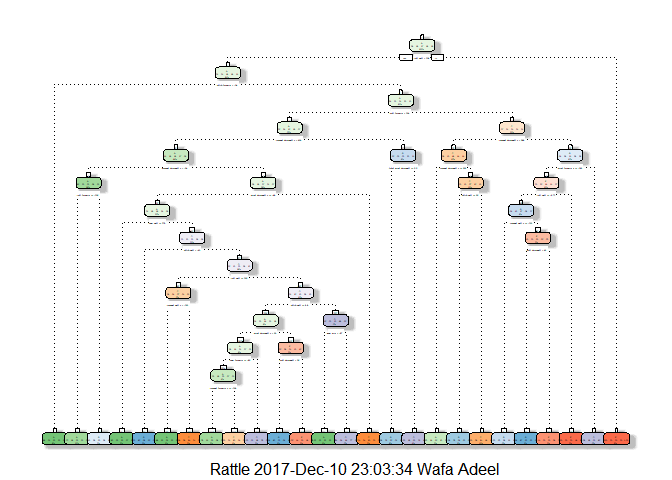

## Introduction
Using devices such as Jawbone Up, Nike FuelBand, and Fitbit it is now possible to collect a large amount of data about personal activity relatively inexpensively. These type of devices are part of the quantified self movement - a group of enthusiasts who take measurements about themselves regularly to improve their health, to find patterns in their behavior, or because they are tech geeks. One thing that people regularly do is quantify how much of a particular activity they do, but they rarely quantify how well they do it. In this project, your goal will be to use data from accelerometers on the belt, forearm, arm, and dumbell of 6 participants. They were asked to perform barbell lifts correctly and incorrectly in 5 different ways. More information is available from the website here: http://web.archive.org/web/20161224072740/http:/groupware.les.inf.puc-rio.br/har (see the section on the Weight Lifting Exercise Dataset).


Data

The training data for this project are available here:

https://d396qusza40orc.cloudfront.net/predmachlearn/pml-training.csv

The test data are available here:

https://d396qusza40orc.cloudfront.net/predmachlearn/pml-testing.csv


### Loading requisite packages
We load the required packages. 

```r
library(caret)
library(randomForest)
library(rpart)
library(rattle)
```

### Loading Dataset

We first download the data from the link mentioned below, if the file already exists on system just read the train and test data files.


```r
train.url="https://d396qusza40orc.cloudfront.net/predmachlearn/pml-training.csv"
test.url="https://d396qusza40orc.cloudfront.net/predmachlearn/pml-testing.csv"
f.train="training.csv"
f.test="testing.csv"
if(!file.exists(f.train))
{
  download.file(train.url, f.train)
}
train<-read.csv(f.train)
if(!file.exists(f.test))
{
  download.file(test.url, f.test)
}
test<-read.csv(f.test)
```

### Splitting Dataset

Here we split our original training frame (60-40) into a training and a testing set labelled "my_test". We set a seed to keep our work repeatable.


```r
set.seed(111)
ind=createDataPartition(train$classe, p=0.6, list=F)
my_test=train[-ind,]
train=train[ind,]
```

### Preparing Dataset
We prepare all three: train, test, and my_test datasets together. First the identifier and info columns that are not used for predictions are removed. Then we check for predictors that have near zero variance and remove them. Then we remove predictors that have more than 50% NA entries. Finally we set the training parameters, we apply cross validation and principal component analysis.


```r
train=train[,-(1:7)]
my_test=my_test[,-(1:7)]
test=test[,-(1:7)]

nzv=nearZeroVar(train)
train=train[,-nzv]
my_test=my_test[,-nzv]
test=test[,-nzv]

narate=function(x){
  l=sapply(x, is.na)*1
  return(sum(l)*100/length(x))
}

grid=apply(train, 2, narate)
highna=which(grid>50)
train=train[,-highna]
grid=apply(my_test, 2, narate)
highna=which(grid>50)
my_test=my_test[,-highna]
grid=apply(test, 2, narate)
highna=which(grid>50)
test=test[,-highna]

tc=trainControl(method="cv", number=3, preProc="pca", verbose=F)
```

### Training

#### Random Forest
We use random forest training and prediction and check its accuracy by drawing up a confusion matrix.


```r
rf=randomForest(classe~., data=train[,-54])
my_testp=predict(rf, newdata=my_test)
confusionMatrix(my_test$classe, my_testp)
```

```
## Confusion Matrix and Statistics
## 
##           Reference
## Prediction    A    B    C    D    E
##          A 2231    1    0    0    0
##          B   17 1495    6    0    0
##          C    0    7 1360    1    0
##          D    0    0   16 1269    1
##          E    0    0    2    1 1439
## 
## Overall Statistics
##                                          
##                Accuracy : 0.9934         
##                  95% CI : (0.9913, 0.995)
##     No Information Rate : 0.2865         
##     P-Value [Acc > NIR] : < 2.2e-16      
##                                          
##                   Kappa : 0.9916         
##  Mcnemar's Test P-Value : NA             
## 
## Statistics by Class:
## 
##                      Class: A Class: B Class: C Class: D Class: E
## Sensitivity            0.9924   0.9947   0.9827   0.9984   0.9993
## Specificity            0.9998   0.9964   0.9988   0.9974   0.9995
## Pos Pred Value         0.9996   0.9848   0.9942   0.9868   0.9979
## Neg Pred Value         0.9970   0.9987   0.9963   0.9997   0.9998
## Prevalence             0.2865   0.1916   0.1764   0.1620   0.1835
## Detection Rate         0.2843   0.1905   0.1733   0.1617   0.1834
## Detection Prevalence   0.2845   0.1935   0.1744   0.1639   0.1838
## Balanced Accuracy      0.9961   0.9955   0.9907   0.9979   0.9994
```

#### RPart
We now use rpart to train the same dataset and check its accuracy by drawing up a confusion matrix. We also print a decision tree using rattle.

```r
dec=rpart(classe~., data=train, method="class")
fancyRpartPlot(dec)
```

```
## Warning: labs do not fit even at cex 0.15, there may be some overplotting
```

<!-- -->

```r
my_testpp= predict(dec, newdata = my_test, type="class")
confusionMatrix(my_test$classe, my_testpp)
```

```
## Confusion Matrix and Statistics
## 
##           Reference
## Prediction    A    B    C    D    E
##          A 2055   79   41   26   31
##          B  236  997  125  120   40
##          C   44  153 1085   86    0
##          D   85  117  192  812   80
##          E   64  170  149   88  971
## 
## Overall Statistics
##                                          
##                Accuracy : 0.7545         
##                  95% CI : (0.7448, 0.764)
##     No Information Rate : 0.3166         
##     P-Value [Acc > NIR] : < 2.2e-16      
##                                          
##                   Kappa : 0.6882         
##  Mcnemar's Test P-Value : < 2.2e-16      
## 
## Statistics by Class:
## 
##                      Class: A Class: B Class: C Class: D Class: E
## Sensitivity            0.8273   0.6577   0.6815   0.7173   0.8654
## Specificity            0.9670   0.9177   0.9547   0.9294   0.9300
## Pos Pred Value         0.9207   0.6568   0.7931   0.6314   0.6734
## Neg Pred Value         0.9236   0.9180   0.9217   0.9512   0.9764
## Prevalence             0.3166   0.1932   0.2029   0.1443   0.1430
## Detection Rate         0.2619   0.1271   0.1383   0.1035   0.1238
## Detection Prevalence   0.2845   0.1935   0.1744   0.1639   0.1838
## Balanced Accuracy      0.8971   0.7877   0.8181   0.8234   0.8977
```
#### Training Conclusion
Since the accuracy of random forest model was better, we use it to predict our test dataset.

### Testing
As the test dataset is already prepared we simply use predict and print out the values.

```r
test_p=predict(rf, newdata = test)
test_p
```

```
##  1  2  3  4  5  6  7  8  9 10 11 12 13 14 15 16 17 18 19 20 
##  B  A  B  A  A  E  D  B  A  A  B  C  B  A  E  E  A  B  B  B 
## Levels: A B C D E
```
These values above are the predictions for the test dataset using random forest.
